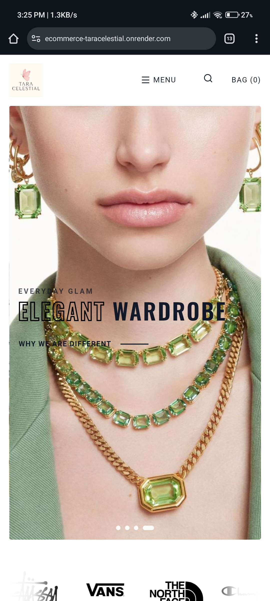
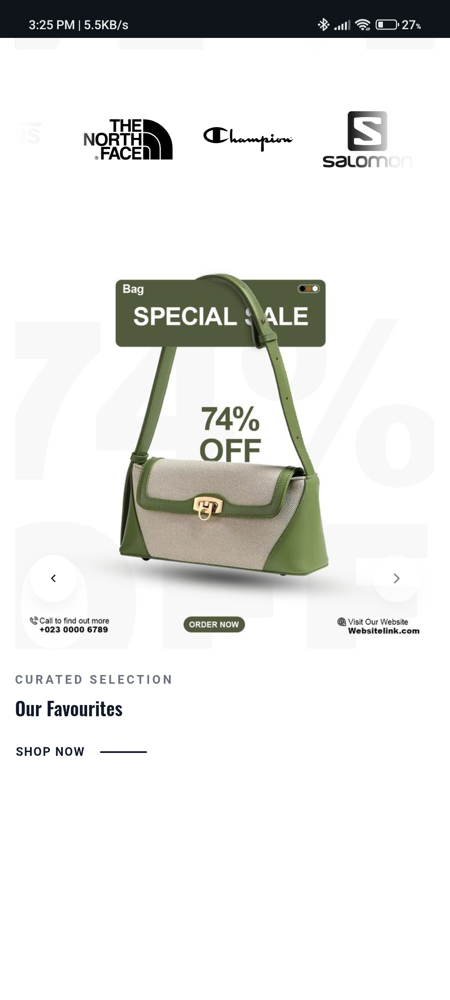
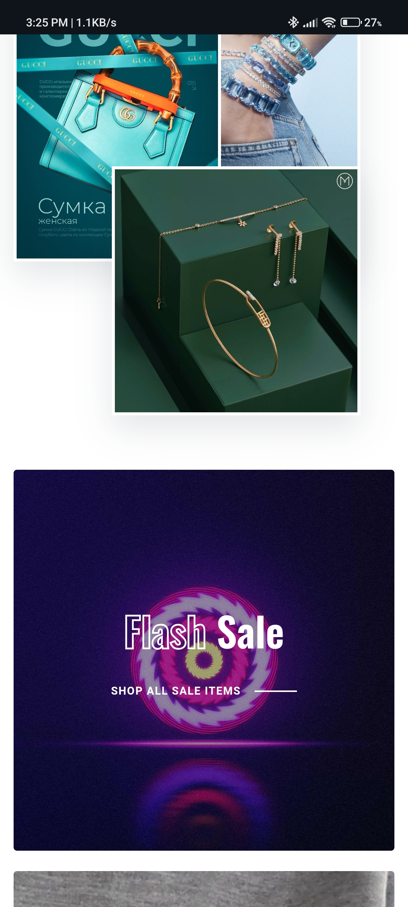

# 💎 Jewellery E-Commerce Website (Django)

A modern **E-Commerce web application for a jewellery store** built using **Django**.  
The platform allows users to browse jewellery collections, view product details, add items to cart, and place orders.

This project demonstrates **full-stack web development using Django**, including product management, user authentication, and order processing.

---

## 🚀 Features

- User registration and login system
- Browse jewellery products
- Product categories
- Product detail pages
- Add to cart functionality
- Order placement system
- Admin panel for product management
- Responsive design

---

## 🛠 Tech Stack

### Backend
- Python
- Django

### Frontend
- HTML
- CSS
- JavaScript
- Bootstrap

### Database
- SQLite (Default Django database)

## 🖥 Admin Panel

Manage products and orders using Django admin:

```
http://127.0.0.1:8000/admin
```

Login using the superuser credentials created earlier.

---

## 📸 Screenshots

Add screenshots of your website homepage here.

Example:







---

## 👨‍💻 Author

**Malhar Kshirsagar**

- AI & ML Student
---
